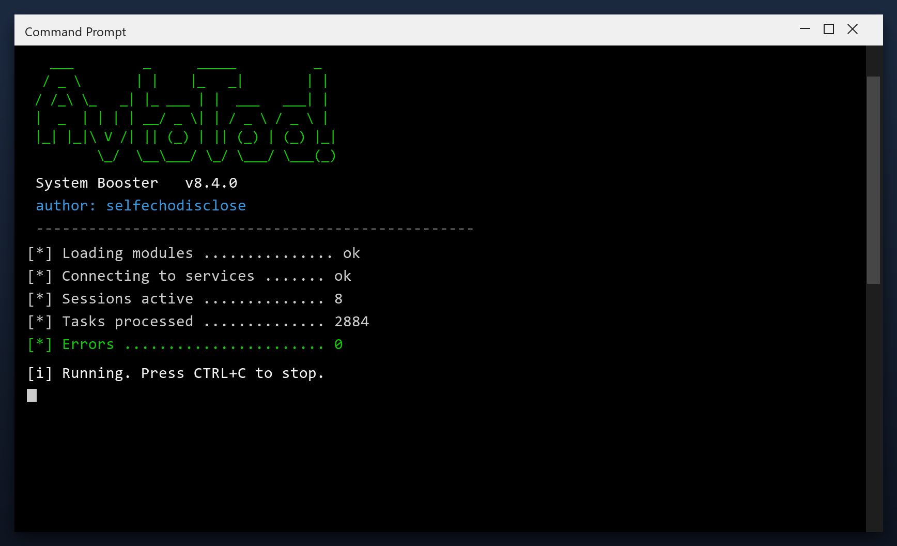

# System Booster: Free Download and Guide (2026)

 

**System booster** scans your PC and removes the junk that slows it down - temporary files, broken entries and leftover data. Everything stays on your own computer. **No telemetry, no cloud, no account.**

  

  

## Questions & Answers

**Will it speed up my games?**

It can help by freeing RAM and stopping background tasks, but it is not a game booster.

**Does it delete my downloads?**

No. It only removes temporary and leftover data, never your own files.

**Can I schedule it?**

Yes, you can set it to run weekly automatically.

**What if I do not like it?**

Uninstall it normally from Windows Settings - it leaves nothing behind.

## What Is It

System booster does three things: it finds junk files, it finds broken settings, and it removes them. That is the whole tool - no social features, no accounts, no ads. It runs as a normal Windows program and works fully offline after you download it.

| **Term** | **Meaning** |
| --- | --- |
| **Junk** | Files no program needs any more |
| **Broken entry** | A setting that points to nothing |
| **Cache** | Temporary data stored for speed |
| **Offline** | Works without an internet connection |

## The Problem

- **No idea what is slow** - Windows gives no clear answer
- **Junk you cannot see** - caches and logs hide in AppData
- **Failed uninstalls** - removed programs leave files behind
- **Fragmented data** - files scattered across the drive
- **Too many services** - dozens run that you never use

## The Fix

| **Problem** | **Solution** |
| --- | --- |
| **Slower every month** | Regular maintenance keeps it fast |
| **Slow shutdown** | Clear stuck background tasks |
| **High idle memory** | Trim memory-hungry apps |
| **Registry bloat** | Remove thousands of dead entries |
| **Messy files** | Find and remove duplicates |

## Step by Step

1. **Grab the file** using the green button
2. **Extract** it to a folder of your choice
3. **Run** the tool (as admin for full access)
4. **Read** the scan report
5. **Apply** the fixes and reboot

> **Note:** on first launch Windows may show a SmartScreen warning because the file is new. Click More info, then Run anyway.

## Features

| **Feature** | **Details** |
| --- | --- |
| **Startup manager** | Turn off unneeded startup apps |
| **Disk tools** | Clean, analyse, defragment |
| **Registry** | Scan and repair entries |
| **Privacy** | Clear usage traces |
| **Scheduler** | Automatic weekly scans |
| **Log** | Keeps a record of changes |

## Requirements

| **Component** | **Details** |
| --- | --- |
| **OS** | Windows 10, 11 |
| **Architecture** | 64-bit |
| **RAM** | 2 GB minimum |
| **Disk space** | 100 MB |
| **Admin rights** | Yes, for cleanup tasks |
| **Internet** | Only to download |

## What You Get

| **Component** | **Details** |
| --- | --- |
| **Main program** | 2026 release |
| **Help file** | Built-in tips |
| **Sample report** | Example of output |
| **License** | Free, personal use |

## Tips

- Run the first scan with admin rights for full results
- Let it finish - do not close the window mid-scan
- Check the report before removing anything large
- Schedule a weekly scan if you use the PC daily
- Exclude the tool's own folder from antivirus

## Troubleshooting

| **Issue** | **Fix** |
| --- | --- |
| **High CPU during scan** | Expected - it throttles when you use the PC |
| **Antivirus blocks cleanup** | Add an exclusion for the tool |
| **Cleanup leaves temp files** | Some are locked - reboot and rescan |
| **Tool asks for admin** | Approve it so it can clean system areas |

## Summary

**System booster** is a simple, reliable maintenance tool for Windows. It does one job well, without adware or confusing options.

**What you get:**

- The latest 2026 build
- Full Windows 10 and 11 support
- Quick setup, clear results
- No payments, no registration

**Get it now - completely free.**

---

*fleet-mirage-309 · Updated 2026-10-09 · Shared under the MIT License*
